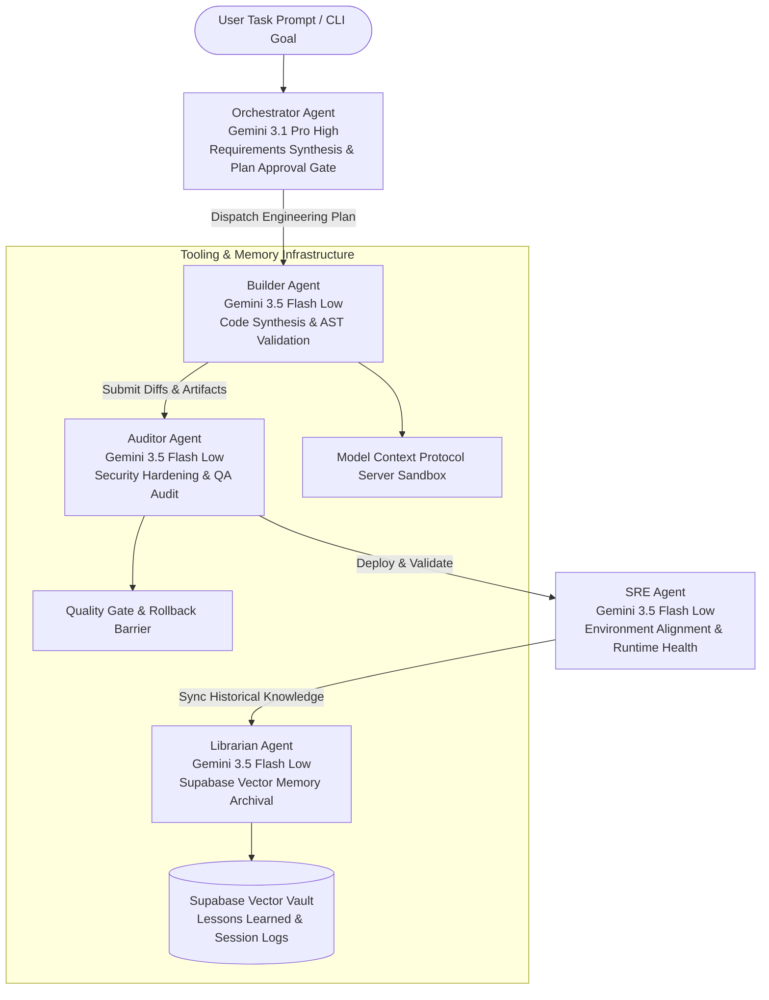

# Google Antigravity 2.0 Python Swarm SDK

[](https://www.python.org/downloads/)
[](https://antigravity.google/docs)
[](https://google.github.io/agent-development-kit/)
[](https://cloud.google.com/vertex-ai)
[](tests/)
[](https://modelcontextprotocol.io/)
[](LICENSE)

A modular, terminal-based multi-agent Python SDK swarm runtime built on **Google Antigravity 2.0** and the **Google Agent Development Kit (ADK)**.

Designed as an extensible foundation for autonomous engineering workflows, the runtime coordinates specialized subagents to handle requirements synthesis, AST-validated code synthesis, automated security and QA audits, infrastructure health checks, and long-term vector memory archival.

---

## System Architecture & Multi-Agent Swarm Flow

The swarm coordinates specialized subagents through an asynchronous event bus and deterministic handoff loop to maintain context isolation and enforce quality gates:



---

## Universal Multi-Domain Swarm Applications

While the SDK includes a default software engineering swarm, its modular subagent topology maps cleanly to any technical problem domain:

| Domain / Use Case | Orchestrator & Planning | Execution & Synthesis | Validation & Archival |
| :--- | :--- | :--- | :--- |
| **Codebase Refactoring** *(Default)* | Architectural plan, dependency mapping | Modular code rewrites, AST validation | Security scan, regression test suite |
| **Automated Security & QA** | Vulnerability assessment plan | Patch generation, defensive sanitization | OWASP verification, audit log sync |
| **Cloud & DevOps / SRE** | Infrastructure drift detection | Terraform / Kubernetes generation | Dry-run validation, health telemetry |
| **Data Pipelines & ETL** | Schema mapping, pipeline design | SQLX / dbt model generation | Dataform dry-run, byte estimate audit |
| **API Integration & Webhooks** | OpenAPI schema contract analysis | Client adapter & handler creation | Idempotency checks, mock unit testing |

---

## Key Engineering Disciplines

### 1. Native SDK Lifecycle & Async Context Management
- Spawns agents using `google.antigravity.Agent` and `LocalAgentConfig` with strict permission boundaries and hook policies (`@policy.pre_tool_call`).

### 2. Deterministic Multi-Agent Handoffs & Plan Approval Gate
- Enforces a 4-phase developer lifecycle: **Discovery** (Librarian) ➔ **Planning & RCA Gate** (Orchestrator) ➔ **Execution** (Builder) ➔ **Verification & Archival** (Auditor/Librarian). Direct file modifications require explicit user approval.

### 3. Native Model Context Protocol (MCP) & Pluggable SaaS Adapters
- Connects to external tool servers defined in `mcp_config.json` (databases, CRMs, Git platforms, and cloud APIs), wrapping all invocations with runtime timeouts and defensive validation.
- Decoupled tool interface enables drop-in integration with any third-party SaaS without framework modifications.

### 4. Long-Term Vector Memory Archival
- Automatically retrieves relevant past lessons learned from Supabase during discovery and indexes resolution summaries at session completion.

---

## Repository Structure

```text
antigravity-sdk/
├── agents/                    # Conversational playbooks & system prompts
│   ├── orchestrator.txt       # System architect & plan approval gatekeeper
│   ├── builder.txt            # Lead software engineer
│   ├── auditor.txt            # QA & security compliance auditor
│   ├── sre.txt                # DevOps & environment reliability master
│   └── librarian.txt          # Memory archivist & technical writer
├── tests/                     # Deterministic offline unit test suite (24 tests)
│   ├── conftest.py            # Test configuration & SDK mock providers
│   ├── test_agent_prompts.py  # Prompt validation across all 5 personas
│   ├── test_mcp_config.py     # MCP Pydantic schemas & header injection
│   ├── test_orchestrator_mock.py # Dry-run execution & approval gates
│   └── test_policies.py       # Permission hooks & safety boundaries
├── native_orchestrator.py      # Native Antigravity 2.0 SDK execution engine
├── DASHBOARD.md               # Swarm operational state & component dashboard
├── librarian.md               # Librarian persona & database schema guidelines
├── pyrightconfig.json         # Static type checker configuration
├── requirements.txt           # Python dependency specifications
├── pyproject.toml             # Pytest configuration & package metadata
├── .env.template              # Environment variable template
└── README.md
```

---

## Quick Start & Swarm Execution

### 1. Clone & Setup Virtual Environment
```bash
git clone https://github.com/dnguyen029/antigravity-sdk.git
cd antigravity-sdk

python3 -m venv .venv
source .venv/bin/activate
pip install -r requirements.txt
```

### 2. Run Offline Unit Tests (Zero Credentials Required)
Execute the complete test suite locally:

```bash
pytest -v
```

```text
============================= test session starts ==============================
tests/test_agent_prompts.py ......                                       [ 25%]
tests/test_mcp_config.py ........                                        [ 58%]
tests/test_orchestrator_mock.py ......                                   [ 83%]
tests/test_policies.py ....                                              [100%]
============================== 24 passed in 0.22s ==============================
```

### 3. Simulated Dry-Run (No Cloud Credentials Required)
Evaluate the multi-agent orchestration sequence locally without API spend:

```bash
python native_orchestrator.py "Refactor database connection pool" --mock
```

### 4. Live Swarm Execution (Vertex AI + Gemini)
Configure your environment variables in `.env`:

```bash
cp .env.template .env
```

Run the autonomous multi-agent swarm:

```bash
python native_orchestrator.py "Implement rate limiting middleware on API endpoints"
```

---

## Configuration & Environment Variables

| Environment Variable | Description | Scope / Notes |
| :--- | :--- | :--- |
| `PROJECT_ID` | GCP Project ID hosting Vertex AI Gemini models | Required for live agent inference |
| `GOOGLE_CLOUD_LOCATION` | Vertex AI regional endpoint (e.g., `us-central1`) | Defaults to `us-central1` |
| `GOOGLE_GENAI_USE_VERTEXAI` | Enables Vertex AI enterprise backend (`True`) | Set to `True` for Vertex AI |
| `SUPABASE_URL` | Supabase project REST API endpoint | Required for long-term memory vault |
| `SUPABASE_ACCESS_TOKEN` | Service role / API key for Supabase memory bank | Required for memory queries |
| `EXA_API_KEY` | Exa search API key for external web research | Optional |

---

## Ecosystem & Related Repositories

* **[receptionist-template](https://github.com/dnguyen029/receptionist-template)** — Production multi-agent conversational voice receptionist application built on the Google ADK and Vertex AI.
* **[antigravity-portfolio](https://github.com/dnguyen029/antigravity-portfolio)** — Technical operations portfolio showcasing end-to-end multi-agent governance and architecture.

---

## License
This project is licensed under the MIT License — see the [LICENSE](LICENSE) file for details.
