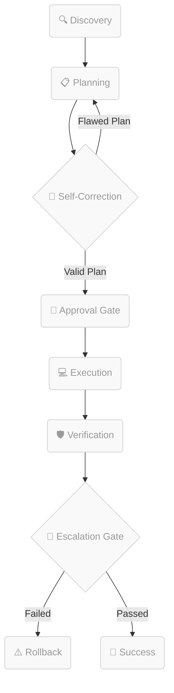

# 🛰️ Swarm Live Execution Monitor

This dashboard displays the active execution phase and handoff flows of the Antigravity Swarm.

---

## ⚡ Active Task
*   **Task**: Swarm Idle (No active session)
*   **Active Agent**: None
*   **Current Phase**: Idle

---

## 📊 Live Flow Monitor

